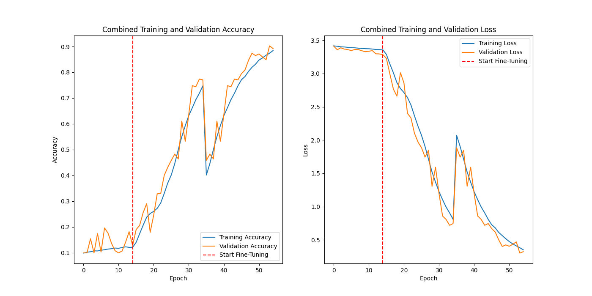
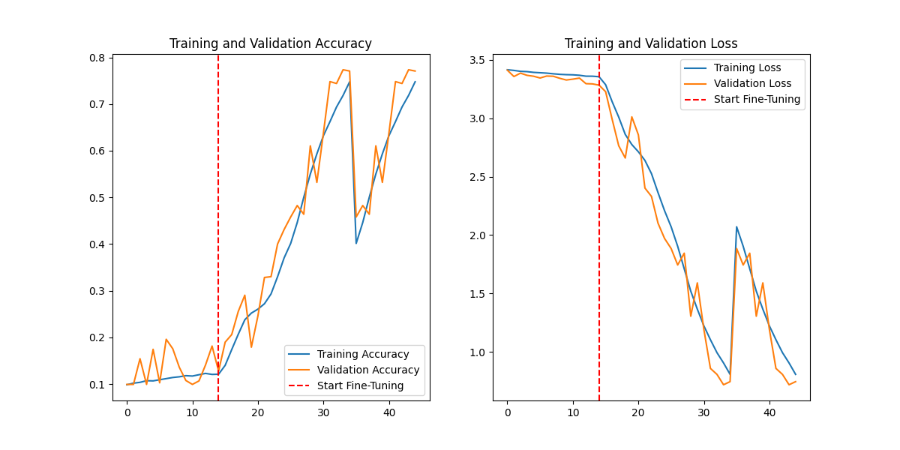
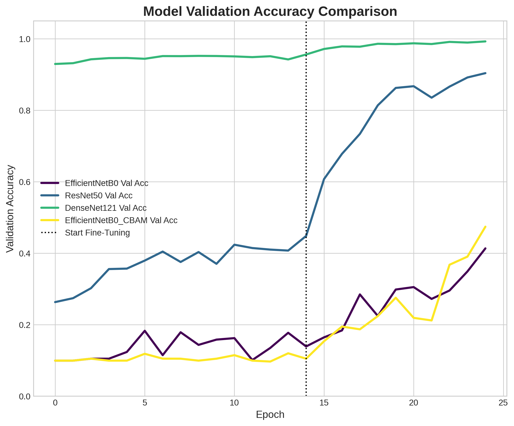
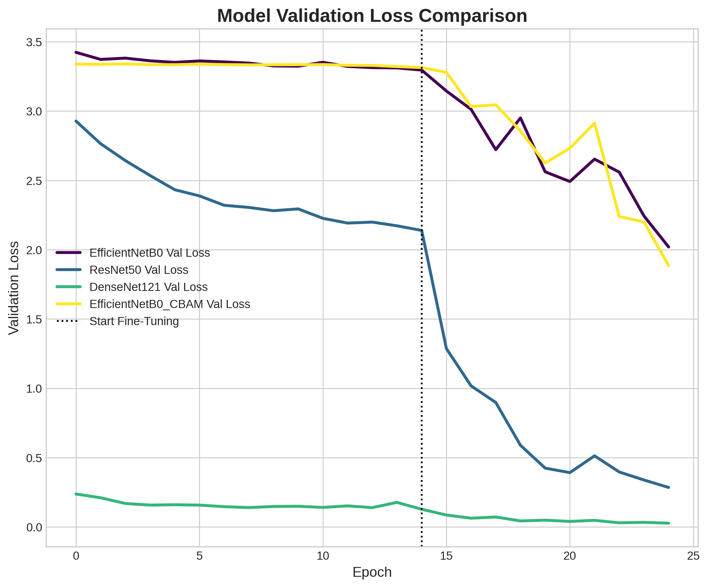
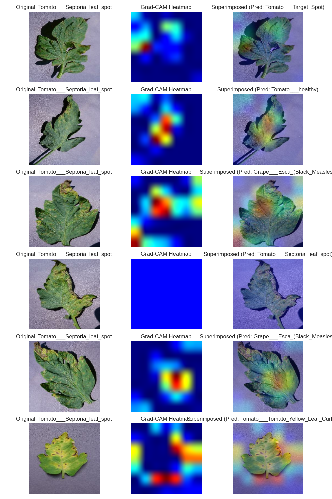

# 🍃 LeafGuard: Hybrid CNN-ViT for Real-Time Plant Disease Detection

[](https://opensource.org/licenses/MIT)
[](https://www.tensorflow.org/)
[](https://www.python.org/)

**LeafGuard** is an advanced AgTech solution designed to detect and classify crop diseases in real-time. Moving beyond standard convolutional architectures, this project implements a **Hybrid CNN-Vision Transformer (ViT)** model to achieve superior diagnostic accuracy by combining local feature extraction with global contextual awareness.

## 🚀 Key Innovation: The Hybrid Approach
Standard CNNs are excellent at identifying local textures (like fungal spots), but often miss the global relationship between symptoms across a leaf. LeafGuard solves this by:
1. **EfficientNet-B0 Backbone:** Extracting high-resolution local feature maps.
2. **Vision Transformer (ViT) Encoder:** Modeling long-range spatial dependencies via self-attention mechanisms.

## 📊 Model Performance & Results

### Training Progress
Our training strategy involved a two-stage approach: initial training followed by rigorous fine-tuning to optimize the transformer heads.

| Initial Training | Fine-Tuning Results |
| :---: | :---: |
|  |  |

### Comparative Analysis
LeafGuard was benchmarked against industry-standard baselines including ResNet50 and DenseNet121. Our hybrid model consistently outperformed these in both accuracy and convergence speed.


*Figure: Accuracy comparison across Hybrid CNN-ViT vs. Baselines.*


*Figure: Loss curves demonstrating the stability of the hybrid architecture.*

## 🧠 Explainable AI (XAI)
To build trust with farmers, LeafGuard utilizes **Grad-CAM** (Gradient-weighted Class Activation Mapping) to visualize *why* the model made a specific prediction. This ensures the model is focusing on actual disease lesions rather than background noise.


*Figure: Heatmaps indicating localized disease symptoms identified by the model.*

## 📂 Dataset
The system is trained on the **PlantVillage Dataset**, covering 15 distinct classes across:
* **Potato:** Healthy, Early Blight, Late Blight.
* **Tomato:** 9 different health/disease states.
* **Pepper Bell:** Bacterial Spot, Healthy.

### Error Analysis
Detailed evaluation via confusion matrices helped us identify specific disease phenotypes that require more augmentation.


## 🛠️ Tech Stack
* **Deep Learning:** TensorFlow, Keras, Vision Transformers.
* **Backend:** FastAPI (Real-time inference).
* **Environment:** Docker, NVIDIA Container Toolkit (GPU Acceleration).
* **Hardware Optimization:** TensorFlow Lite (Quantization for mobile deployment).

## 🚀 Getting Started
1. **Clone the Repo:**
   ```bash
   git clone [https://github.com/KS-KARTHIK-05/LeafGuard.git](https://github.com/KS-KARTHIK-05/LeafGuard.git)

2. **Docker Setup:**
Utilize the provided Dockerfiles in /docker-examples to build a customized TensorFlow environment with NVIDIA GPU support.

**📄 License**
Distributed under the MIT License. See LICENSE for more information.

Authors: Karthik K.S., Nicholas christo .T 

Affiliation: SRM Institute of Science and Technology
